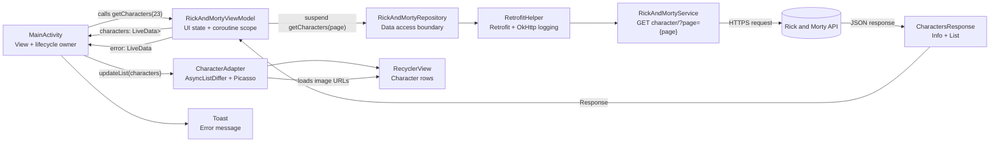
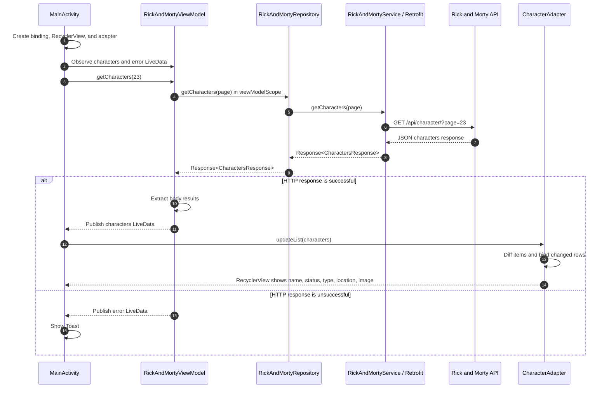

# RickAndMortyRetrofit
https://github.com/user-attachments/assets/3acac4ce-3733-4273-86de-d7dae179e5fc


# RickAndMortyRetrofit

An Android app that fetches a page of characters from the [Rick and Morty API](https://rickandmortyapi.com/) and displays them in a scrollable list. It uses the MVVM pattern, Retrofit, coroutines, LiveData, and RecyclerView.

## Architecture at a glance



### Layer responsibilities

| Layer | Current class(es) | Responsibility |
| --- | --- | --- |
| View | `MainActivity`, `activity_main.xml` | Creates the screen, observes `LiveData`, and configures the list. |
| Presentation | `RickAndMortyViewModel` | Starts the network coroutine, exposes characters and error states. |
| Data | `RickAndMortyRepository` | Keeps the ViewModel independent from the Retrofit service. |
| Network | `RetrofitHelper`, `RickAndMortyService` | Configures HTTP/Gson and declares the API endpoint. |
| Model | `CharactersResponse`, `Result`, `Info`, `Location`, `Origin` | Maps API JSON into Kotlin data classes. |
| List rendering | `CharacterAdapter`, `activity_item.xml` | Efficiently updates rows with `AsyncListDiffer` and loads character images with Picasso. |

## Character-loading flow



## Project map

```text
app/src/main/java/com/projects/rickandmorty/
├── view/
│   └── MainActivity.kt          # Screen setup and LiveData observers
├── viewmodel/
│   └── RickAndMortyViewModel.kt # Presentation state and coroutine request
├── repository/
│   └── RickAndMortyRepository.kt# Data-access boundary
├── remote/
│   ├── RetrofitHelper.kt        # Retrofit, Gson, OkHttp configuration
│   └── RickAndMortyService.kt   # API contract
├── model/                       # API response data classes
└── util/
    └── CharacterAdapter.kt      # RecyclerView binding and image loading
```

## Request reference

The app currently loads the hard-coded page `23` when `MainActivity` is created:

```kotlin
viewModel.getCharacters(23)
```

This results in:

```text
GET https://rickandmortyapi.com/api/character/?page=23
```

To load another page, pass a different page number to `getCharacters(page)`. A later pagination feature can keep the same flow and update only the page source in the ViewModel.
